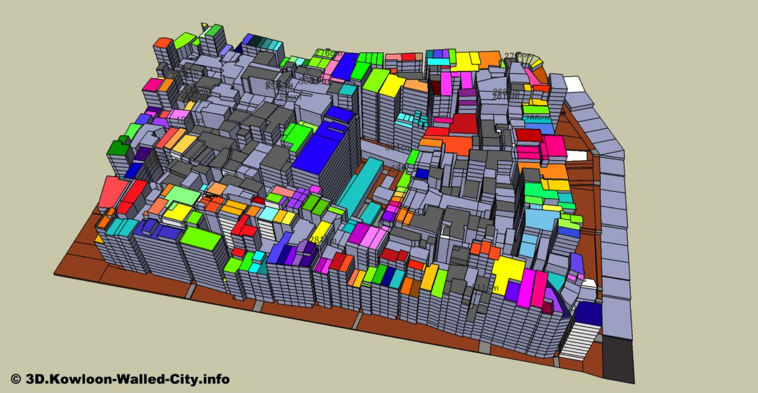
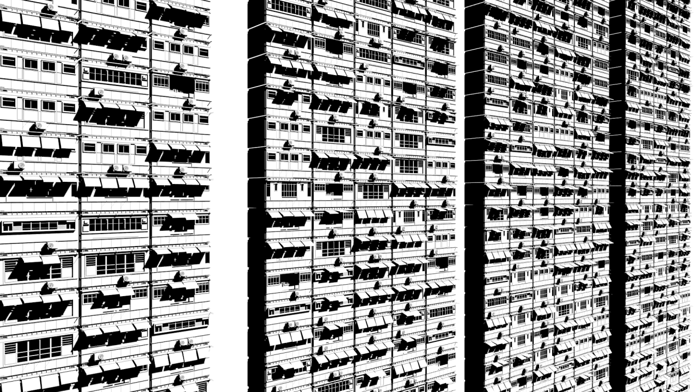
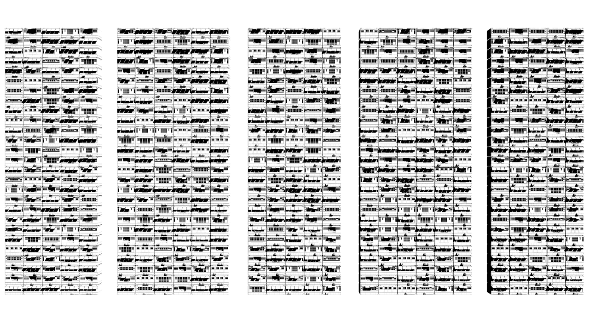

# Kowloon Walled City VR

## Source data

The original Sketchup file is from this Japanese group [working to create the model](http://3d.kowloon-walled-city.info/top/en). (NOTE: site is gone, looks like)

They published on [3dwarehouse.com here](https://3dwarehouse.sketchup.com/collection/u86e3e850-75c6-41f8-bb8c-db9ae8d660d5/Kowloon-Walled-City?sortBy=modifyTime%20DESC&searchTab=model&hl=en).

## Surface vs model

I saw [this post](https://twitter.com/mflux/status/874182080359350273) from @mflux about procedural building generation that looked in the right direction. (post archived in `~/references` dir)

And @colonthree replied with [examples of their work which was even closer](https://twitter.com/Colonthreee/status/874278263186747392). (NOTE: account is gone, looks like)

Their [tumblr post](https://colonthreeenterprises.tumblr.com/post/130285597286/finally-i-got-to-test-the-particle-setup-i-had-in) has more detail. (post archived in `~/references` dir)

The "splash some paint on" approach would to apply those approaches to generating material for surfaces.

More interesting would be to integrate the object file as instructions for the procedural generation of the buildings.

